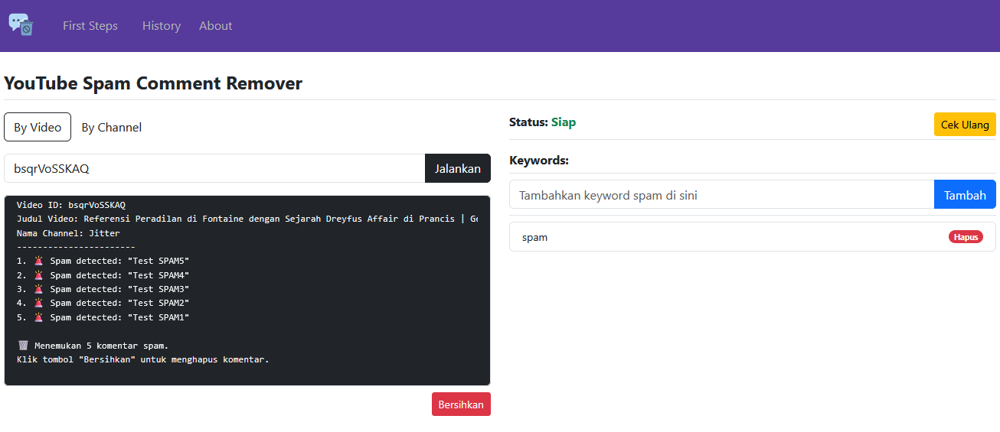
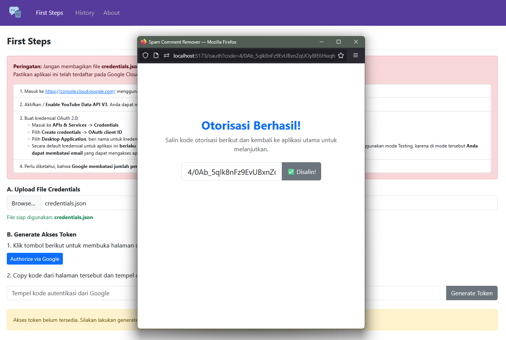
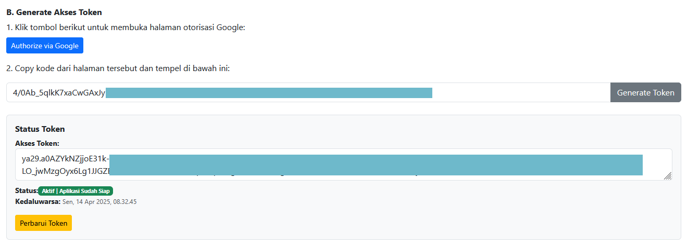
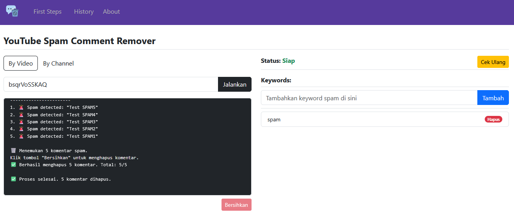
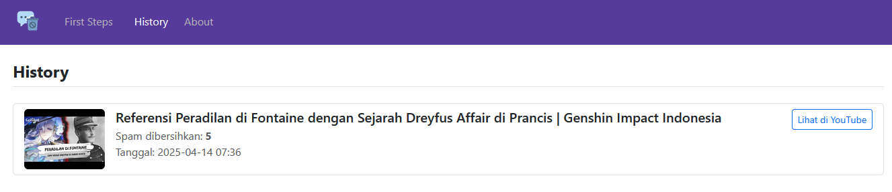

# YouTube Spam Comment Remover - Vue.js
Aplikasi ini digunakan untuk menghapus spam komentar pada YouTube berdasarkan kata kunci tertentu dan kata yang memiliki karakter khusus. 

> [!NOTE]
> *Konsep Dasar: <a href="https://github.com/MBenedictt/JudolSlayerProject" target="_blank" rel="noopener">https://github.com/MBenedictt/JudolSlayerProject</a>*



## Langkah-langkah Penggunaan
**Langkah 1 (Wajib): Pastikan Sudah Terpasang Node.js**
- Unduh Node.js versi LTS di halaman resminya: <a href="https://nodejs.org/" rel="noopener" target="_blank">https://nodejs.org/</a> dan install.
- Untuk memastikan Node.js telah terpasang, bukan Command Prompt (CMD) atau terminal dan jalankan:
-  >```node -v``` dan ```npm -v```

<br/>**Langkah 2 (Opsional): Install Text Editor seperti Visual Studio Code jika ingin merubah kode yang ada pada project.**
- Unduh di <a href="https://code.visualstudio.com/" target="_blank" rel="noopener">https://code.visualstudio.com/</a> dan install seperti biasa.

<br/>**Langkah 3 (Wajib): Unduh dan Extract Project Ini**
- Unduh project ini bisa dengan cara klik tombol berwarna biru yang bertulisan '**Code**' dan klik '**Download Zip**', jangan lupa simpan dan extract here.
- Jika sudah di extract seharusnya ada folder bernama '**youtube-spam-comment-remover**'. Buka folder tersebut di terminal.
- Jalankan perintah berikut untuk menginstall package yang diperlukan dari server npm:
- > ```npm install```
- Jika pemasang package sudah berhasil, jalankan perintah berikut untuk menjalankan aplikasi:
- > ```npm run dev```
- Seharusnya aplikasi sudah bisa dibuka, jika tidak melakukan perubahan apapun pada config vite-nya. Aplikasi ini secara default akan berjalan di **http://localhost:5173**.

<br/>**Langkah 4 (Wajib): Aktifkan YouTube Data API dan Buat OAuth Client ID**
<br/>Karena aplikasi ini berjalan pada localhost atau perangkat masing-masing, maka Anda perlu mendaftarkan aplikasinya ke Google Cloud Platform agar bisa menggunakan YouTube Data API melalui aplikasi ini.
- Kunjungi <a href="https://console.cloud.google.com" target="_blank" rel="noopener">Google Cloud Platform</a>
- Buat project baru (atau pilih project yang sudah ada jika pernah menggunakan GCP)
- Aktifkan YouTube Data API v3:
  - Klik menu API & Services → Library
  - Cari “YouTube Data API v3” → klik → lalu klik tombol Enable
- Buat kredensial OAuth 2.0:
  - Masuk ke API & Services → Credentials
  - Klik Create Credentials → pilih OAuth Client ID
  - Pilih "Desktop App" sebagai tipe aplikasi
  - Unduh file credentials dan simpan saja dengan nama **credentials.json**

> [!WARNING]
> *Simpanlah file **credentials.json** dengan aman dan jangan bagikan ke siapapun.*

> [!TIP]
> *Secara default kredensial untuk aplikasi ini berlaku untuk mode Testing. Anda dapat melihatnya pada menu Audience. Saya merekomendasikan untuk tetap menggunakan mode Testing, karena di mode tersebut Anda dapat membatasi email yang dapat mengakses aplikasi ini. Jadi, pastikan email Anda telah terdaftar pada menu Audience sebagai Test users.*


<br/>**Langkah 5 (Wajib): Upload File credentials.json dan Generate Akses Token**
- Setelah aplikasi dibuka di browser, bukalah menu **First Steps** dan upload file **credentials.json**, apabila file valid maka akan terbuka langkah berikutnya untuk melakukan otorisasi atau login dengan akun Google.
- Loginlah dengan menggunakan akun Google yang memiliki Channel YouTube yang berisi komentar spam yang akan dihapus.
- Setelah login berhasil, Anda akan diberi kode autentikasi. Copy kode tersebut kemudian paste / tempel pada input untuk generate token. Klik tombol 'Generate Token' untuk memperoleh akses token pertama. Jika berhasil, pada halaman tersebut akan muncul detail status dari akses token tersebut. Akses token dari Google hanya berlaku selama satu jam dan jika sudah kadaluwarsa, cukup klik perbarui token.
- Jika akses token valid, status aplikasi siap digunakan dan Anda sudah bisa untuk scan dan membersihkan komentar spam yang bisa dilakukan di halaman utama.






> [!TIP]
> *Untuk mode '**By Channel**', gunakanlah Channel ID YouTube yang bisa Anda dapatkan di <a href="https://www.youtube.com/account_advanced">https://www.youtube.com/account_advanced</a>*

> [!IMPORTANT]
> *YouTube Data API v3 memiliki batas penggunaan sebanyak 10.000 API quota units per hari, sehingga jika Anda telah menjalankan program ini beberapa kali dalam sehari, Anda dapat mencapai batas API quota harian sehingga program tidak dapat menghapus komentar hingga besok.*

## FAQ
### *Kenapa tidak dihosting?*
Untuk versi sekarang, sangat direkomendasikan untuk dijalankan pada perangkat masing-masing atau localhost, hal ini juga menjawab kenapa memerlukan file credentials.json yang diperoleh dari Google Cloud Platform. Jika sudah dihosting, mungkin hanya pihak yang menghostingnya saja yang memerlukan file credentials.json dan user cukup login menggunakan akun Google mereka sendiri tanpa perlu memperoleh file credentials. Tapi, menghosting aplikasi ini perlu peninjauan lebih lanjut khususnya terhadap celah keamanan dan kemampuan servernya dalam menerima request. Itu sebabnya aplikasi ini lebih baik dijalankan di localhost. 

### *Bagaimana aplikasi ini menyimpan file credentials user?*
Konsep dari aplikasi ini adalah sepenuhnya berjalan di sisi client, yang artinya semua disimpan di penyimpanan local browser yang Anda gunakan. Seperti manajemen keywords dan history, keduanya dikelola menggunakan teknologi IndexedDB (database pada browser modern seperti Chrome atau Firefox seharusnya sudah mendukung). Sedangkan file credentials.json dan token disimpan pada local storage browser. Jika Anda penasaran, silahkan bukan Developer Tools -> Storage / Application di browser Anda untuk melihat data yang disimpan. Ini artinya, saat Anda berpindah ke browser baru untuk membuka aplikasi ini, maka semua data di browser lama tidak akan terbawa. Karena semua berjalan di sisi client terlebih lagi di localhost, maka keamanan data adalah tanggung jawab masing-masing. Saat Anda menghapus data pada browser lama, maka semua data yang tersimpan juga akan hilang. 

### *Apakah aplikasi ini gratis?*
Aplikasi ini dibuat dengan tujuan untuk memudahkan menghapus spam komentar pada YouTube. Di sisi lain, pengembang dari aplikasi ini juga masih dalam tahap belajar. Oleh karena itu, aplikasi ini gratis dan open source.

### *Apakah mampu menghapus ribuan komentar spam?*
Jujur saja, saya belum melakukan pengujian dengan ribuan komentar spam. Jika ratusan saya rasa program ini masih sanggup. Jika ribuan atau bahkan puluhan ribu, masih perlu dilakukan pengujian. Mengingat Google membatasi quota penggunaannya per hari dan juga kode program untuk memindai dan menghapus komentar menggunakan iterasi (perulangan) dan datanya disimpan sementara dalam array yang berarti bergantung pada tingkat memori yang dimiliki oleh browser juga.


